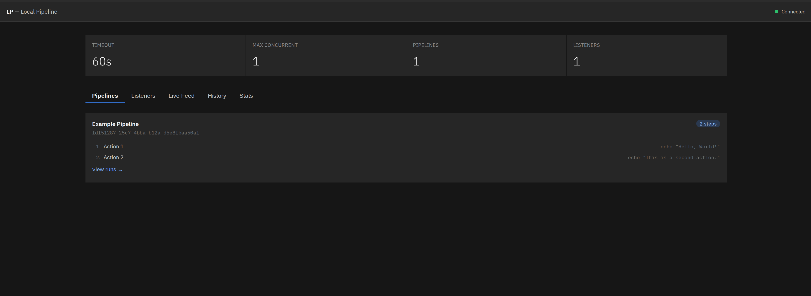

# LP - Local Pipeline

Local Pipeline (LP) is a lightweight automation server that watches for local triggers (such as file changes), matches
them to YAML-defined pipelines, and executes pipeline steps as OS commands. Pipeline results are printed directly to the
CLI in real time.

## Quick Start

```bash
# Build
go build -o lp-server ./cmd/server

# Run
./lp-server configuration.yaml
```

## Configuration

LP is driven by a single YAML configuration file:

```yaml
api_addr: ":8080"          # REST API address (empty disables API)

runners:
  timeout: 60            # per-pipeline timeout in seconds
  max_concurrent: 4      # max pipelines running in parallel
  hooks: # optional lifecycle hook commands
    - on: pipeline_completed
      command: "echo done"
      timeout: 10

pipelines:
  directories:
    - ./pipelines        # directories to scan for pipeline YAML files

listeners:
  - type: file_watcher
    name: watch-src
    pipeline: build      # pipeline name to trigger
    config:
      path: ./src
      pattern: "*"
      interval: 2        # poll interval in seconds
```

## Pipeline Definition

Each pipeline is a YAML file placed in a configured directory:

```yaml
name: build
steps:
  - name: compile
    command: go build ./...
    dir: /path/to/project
    env:
      - CGO_ENABLED=0
  - name: test
    command: go test ./...
    emit:
      - event: tests_passed
        pipeline: deploy
emit:
  - event: build_done
    pipeline: notify
```

Steps run sequentially through `sh -c`, so shell features (pipes, redirects, PATH resolution) work out of the box.

### Event Emission

Pipelines and individual steps can fire events using the `emit` field. Each emitted event triggers a target pipeline
by name, enabling pipeline chaining:

- **Step-level `emit`** — fires after the step completes successfully.
- **Pipeline-level `emit`** — fires after all steps complete successfully.

```
Pipeline A ──step completes──▶ emits "tests_passed" ──▶ triggers Pipeline B
            ──all steps done──▶ emits "build_done"  ──▶ triggers Pipeline C
```

## Architecture

```
┌────────────┐     events     ┌────────────┐    submit    ┌────────────┐
│  Listeners │ ─────────────▶ │   Server   │ ───────────▶ │  Pool      │
│ (triggers) │                │  (routing) │              │ (runners)  │
└────────────┘                └────────────┘              └────────────┘
```

### Listeners

Listeners monitor triggers and produce events. Each listener is bound to a pipeline name and a trigger type.

**Built-in listener types:**

| Type           | Description                                                         | Config keys                   |
|----------------|---------------------------------------------------------------------|-------------------------------|
| `file_watcher` | Polls a directory for new or modified files                         | `path`, `pattern`, `interval` |
| `webhook`      | HTTP server that fires events on `POST /{event_name}`               | `addr`, `events`              |
| `git_hook`     | Installs shims into `.git/hooks` to trigger pipelines on Git events | `repo`, `hooks`               |

Custom listener types can be registered via `RegisterListenerFactory`.

#### Git Hook Listener

The `git_hook` listener integrates with Git's native hook system. On start, it installs lightweight shim scripts into
the repository's `.git/hooks/` directory. When Git fires a hook (e.g. during commit or push), the shim calls a local
HTTP server managed by the listener, which emits an LP event to trigger the configured pipeline.

```yaml
listeners:
  - type: git_hook
    name: commit-hooks
    pipeline: lint
    config:
      repo: /path/to/repo
      hooks:
        - pre-commit
        - post-commit
        - pre-push
```

| Config key | Required | Description                                 |
|------------|----------|---------------------------------------------|
| `repo`     | yes      | Absolute path to the Git repository root    |
| `hooks`    | yes      | List of Git hook names to install shims for |

**Backup behaviour:** If an existing hook script is found, it is renamed to `<hook>.lp-backup` before the shim is
installed. The original hook is called after the shim completes. On `Stop`, shims are removed and backups are restored.

### Server

The server wires everything together:

1. Loads YAML configuration and pipeline definitions from disk.
2. Registers listeners with the listener manager.
3. Routes incoming events to the matching pipeline by name.
4. Submits matched pipelines to the runner pool for execution.
5. Prints pipeline and step results directly to the CLI via lifecycle hooks.

### Runners

The runner pool executes pipelines concurrently up to a configurable limit (`max_concurrent`). Each pipeline's steps
execute sequentially within a per-pipeline timeout. Step commands run via `sh -c` and capture both stdout and stderr.

## CLI Output

All server output uses a uniform timestamped format:

```
[HH:MM:SS] PREFIX message
```

Prefixes indicate the message type:

| Prefix | Meaning                                 |
|--------|-----------------------------------------|
| `INFO` | Informational (startup, config, events) |
| ` OK ` | Success (step/pipeline completed)       |
| `FAIL` | Failure (step/pipeline failed, panics)  |
| `EVNT` | Event fired (listener or pipeline emit) |
| ` RUN` | Execution started (pipeline/step)       |
| ` OUT` | Captured command output (stdout/stderr) |

Example output:

```
[14:32:01] INFO  pipeline loaded: build (id=abc123, steps=2)
[14:32:01] INFO  server started
[14:32:03]  RUN  pipeline build started
[14:32:03]  RUN  step build/compile started
[14:32:04]   OK  step build/compile completed
[14:32:04]  OUT  stdout: ok
[14:32:04]  RUN  step build/test started
[14:32:05]   OK  step build/test completed
[14:32:05]   OK  pipeline build completed (2 steps)
```

Failed steps:

```
[14:32:03]  RUN  pipeline build started
[14:32:03]  RUN  step build/compile started
[14:32:04] FAIL  step build/compile: exit status 1: error message
[14:32:04] FAIL  pipeline build: pipeline "build" step 0 (compile): ...
```

## REST API

When `api_addr` is set in the configuration, LP starts an HTTP server exposing the current state and execution history.

| Endpoint                     | Method | Description                                                                    |
|------------------------------|--------|--------------------------------------------------------------------------------|
| `/api/status`                | GET    | Current server context: config, loaded pipelines, hook stats                   |
| `/api/history`               | GET    | Ledger entries (all events/logs). Filter with `?category=pipeline&level=error` |
| `/api/pipelines`             | GET    | All registered pipelines with their steps                                      |
| `/api/pipelines/{name}/runs` | GET    | Execution history (runs) for a specific pipeline                               |

Example:

```bash
# Server status and stats
curl http://localhost:8080/api/status

# Full event history
curl http://localhost:8080/api/history

# Only pipeline errors
curl "http://localhost:8080/api/history?category=pipeline&level=error"

# All pipelines
curl http://localhost:8080/api/pipelines

# Runs for "build" pipeline
curl http://localhost:8080/api/pipelines/build/runs
```

## Lifecycle Hooks

Six hook events fire during execution and can be used to run external commands or register custom callbacks:

| Event                | Fires when                                 |
|----------------------|--------------------------------------------|
| `pipeline_started`   | A pipeline begins execution                |
| `pipeline_completed` | A pipeline finishes all steps successfully |
| `pipeline_failed`    | A pipeline step fails                      |
| `step_started`       | A step begins execution                    |
| `step_completed`     | A step finishes successfully               |
| `step_failed`        | A step fails                               |

Hooks configured in YAML run as external commands with environment variables (`LP_PIPELINE`, `LP_STEP`, `LP_ERROR`).

## Observability

- **Structured logging** — JSON logs via `log/slog`, scoped per component.
- **Ledger** — Append-only categorized user-feedback log store with level/source/category queries.
- **Collector** — Aggregates hook emission stats and custom counters across components.
- **Hook trackers** — Count emissions and recover panics in hook callbacks.

## Project Structure

```
cmd/server/              # Server entrypoint and YAML configuration wiring
internal/git-hooks/      # Git hook integration listener
internal/hooks/          # Generic, reusable event hook registry (Go generics)
internal/listener/       # Trigger monitoring and event production
internal/logging/        # Categorized user-feedback log collection
internal/observability/  # Structured logging and metrics collection
internal/pipeline/       # YAML-defined pipelines with per-run logs and observability
internal/runners/        # Core pipeline execution engine (Pool, Pipeline, Step, Hooks)
```

## Dependencies

- Go 1.26+
- `gopkg.in/yaml.v3` — YAML parsing
